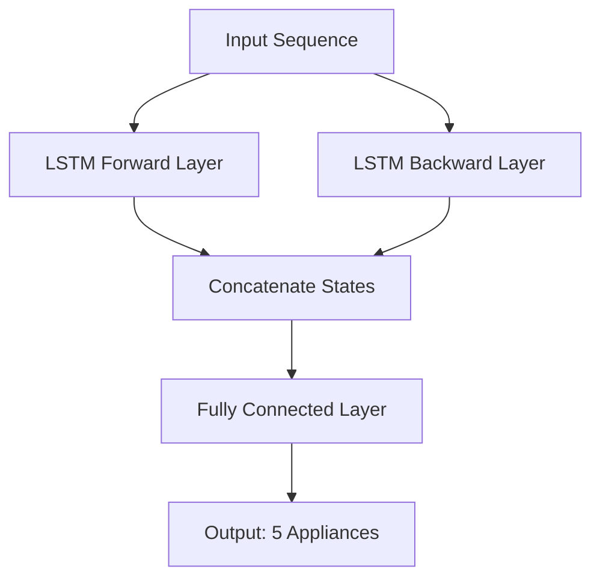

# Understanding NILM and Project Architecture

This document provides a deep dive into the concepts behind Non-Intrusive Load Monitoring (NILM), how it works, and the specific model architectures used in this project.

## 1. What is NILM?

**Non-Intrusive Load Monitoring (NILM)**, often called **Energy Disaggregation**, is a technique used to estimate the energy consumption of individual appliances from a single meter measuring the total aggregate power of a building or facility.

### The Concept
Imagine listening to an orchestra recording. You hear the combined sound of violins, cellos, flutes, and drums. A trained ear (or a sophisticated algorithm) can "disaggregate" this sound to identify when the drums are playing or how loud the violins are.

NILM does the same for electricity:
- **The "Orchestra"**: The total power consumption measured at the main breaker.
- **The "Instruments"**: Individual appliances (EV Chargers, Solar Panels, Cooling Systems, etc.).
- **The "Listener"**: The AI model (TCN, LSTM, etc.) that breaks down the total signal into its components.

### Why is it important?
- **Cost-Effective**: No need to install expensive sub-meters for every machine or appliance.
- **Scalable**: Can be applied to any facility with a smart meter.
- **Actionable Insights**: Helps identify energy waste, equipment faults, or optimization opportunities.

---

## 2. How It Works: The Workflow

The process of disaggregation in this project follows a standard pipeline:

1.  **Data Acquisition**: Smart meters record the total power usage (Aggregate) over time.
2.  **Preprocessing**:
    -   **Resampling**: Data is smoothed or averaged to a fixed time resolution (e.g., 5 minutes).
    -   **Normalization**: Power values are scaled (e.g., using Z-score standardization) so the AI model can process them effectively.
    -   **Windowing**: The continuous time series is sliced into fixed-length sequences (windows) to provide context to the model.
3.  **Inference (Disaggregation)**: The trained Deep Learning model looks at the window of aggregate power and predicts the power usage of specific appliances for that timeframe.
4.  **Post-Processing**: The model's output is scaled back to the original units (Watts/Megawatts) and cleaned up (e.g., removing negative values for loads).

---

## 3. Project Inputs and Outputs

This specific project is designed for an **Industrial** setting using the **SIDED** dataset.

### Inputs
The model takes a single time-series sequence as input:
*   **Source**: Main aggregate power meter.
*   **Feature**: Active Power (Normalized).
*   **Sequence Length**: `288` time steps.
    *   At 5-minute resolution, this represents **24 hours** of context.
*   **Shape**: `(Batch_Size, 288, 1)`

### Outputs
The model predicts the power consumption for **5 specific appliances/components** simultaneously:

1.  **EVSE** (Electric Vehicle Supply Equipment): EV Chargers.
2.  **PV** (Photovoltaic): Solar power generation (typically negative values in raw data, but treated as a component).
3.  **CS** (Cooling System): HVAC or industrial cooling.
4.  **CHP** (Combined Heat and Power): A generator that produces electricity and heat.
5.  **BA** (Battery/Building Automation): Energy storage or auxiliary systems.

*   **Shape**: `(Batch_Size, 5)` (Predicting the value for the last time step in the sequence).

---

## 4. Model Architectures

We utilize several advanced Deep Learning architectures. Below are the visual representations of the key models.

### A. Temporal Convolutional Network (TCN)
The TCN uses dilated convolutions to capture long-range dependencies in the time series without the computational cost of RNNs. It "looks back" in time using an expanding receptive field.

```mermaid
graph TD
    Input[Input Sequence (288, 1)] --> Conv1[Dilated Conv Block 1<br/>Dilation=1]
    Conv1 --> Conv2[Dilated Conv Block 2<br/>Dilation=2]
    Conv2 --> Conv3[Dilated Conv Block 3<br/>Dilation=4]
    Conv3 --> Conv4[Dilated Conv Block 4<br/>Dilation=8]
    Conv4 --> GAP[Global Average Pooling]
    GAP --> FC[Fully Connected Layer]
    FC --> Output[Output: 5 Appliances]

    style Input fill:#f9f,stroke:#333,stroke-width:2px
    style Output fill:#9f9,stroke:#333,stroke-width:2px
```

### B. Attention TCN (ATCN)
This enhances the TCN by adding an **Attention Mechanism**. Instead of just averaging the features (Global Average Pooling), the model learns to "pay attention" to specific time steps that are most relevant for identifying an appliance (e.g., the moment a motor starts).

```mermaid
graph TD
    Input[Input Sequence] --> TCN[TCN Backbone<br/>(Feature Extractor)]
    TCN --> Features[Temporal Features]
    Features --> Attn[Attention Layer<br/>(Compute Weights)]
    Features --> Weighted[Weighted Sum]
    Attn -.->|Weights| Weighted
    Weighted --> FC[Fully Connected Layer]
    FC --> Output[Output: 5 Appliances]

    style Attn fill:#ff9,stroke:#333,stroke-width:2px
```

### C. CNN-LSTM Hybrid
This architecture combines the strengths of Convolutional Neural Networks (CNN) and Long Short-Term Memory (LSTM) networks.
1.  **CNN**: Extracts local patterns and features from the raw signal (like edges or spikes).
2.  **LSTM**: Analyzes the sequence of these features over time to understand temporal context.

```mermaid
graph LR
    Input[Input Sequence] --> Conv1[Conv1D Layer]
    Conv1 --> Pool1[MaxPooling]
    Pool1 --> Conv2[Conv1D Layer]
    Conv2 --> Pool2[MaxPooling]
    Pool2 --> LSTM[LSTM Layer<br/>(Temporal Processing)]
    LSTM --> FC[Fully Connected Layer]
    FC --> Output[Output: 5 Appliances]
```

### D. Bidirectional LSTM (BiLSTM)
Standard LSTMs only look forward in time. BiLSTMs process the sequence in **both directions** (past-to-future and future-to-past). This is useful because knowing what happens *after* an event can help classify the event itself (e.g., recognizing the shutdown signature of a machine helps confirm it was running).


