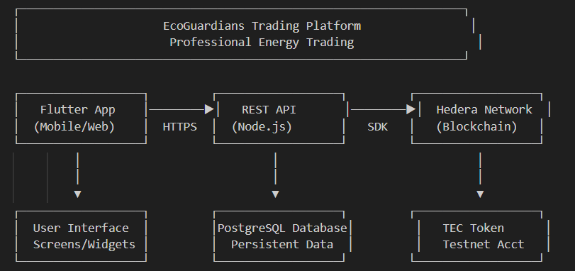
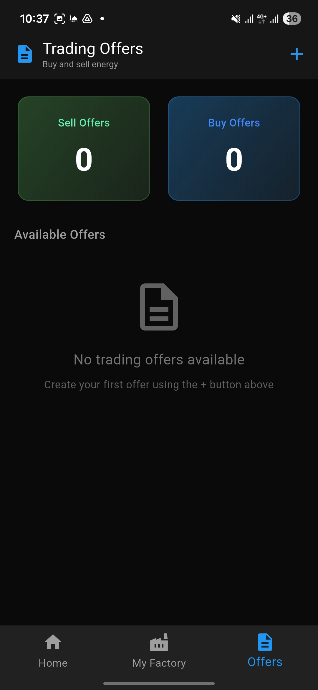
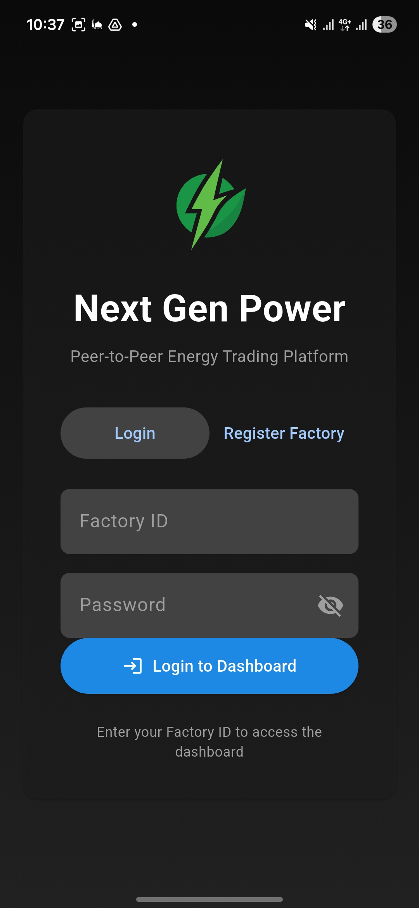
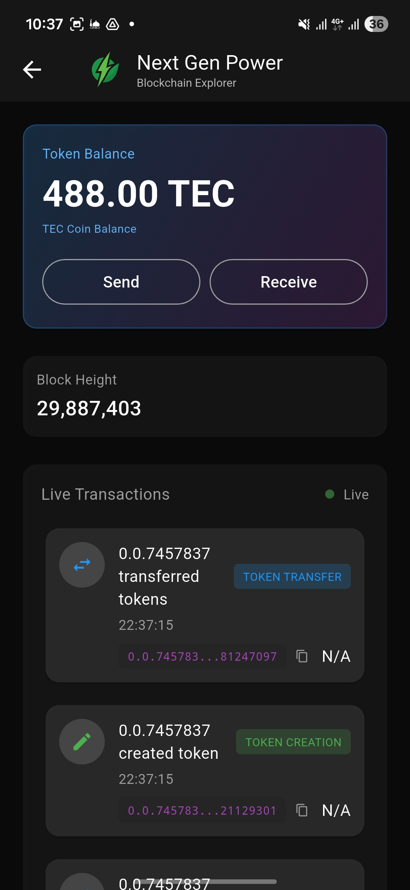
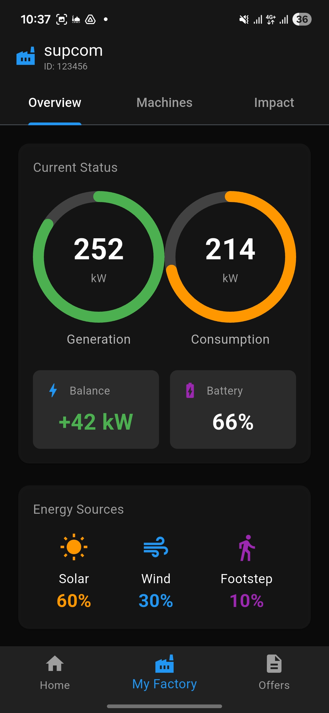
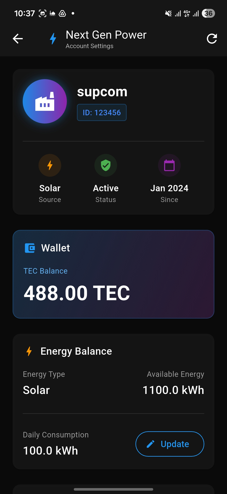
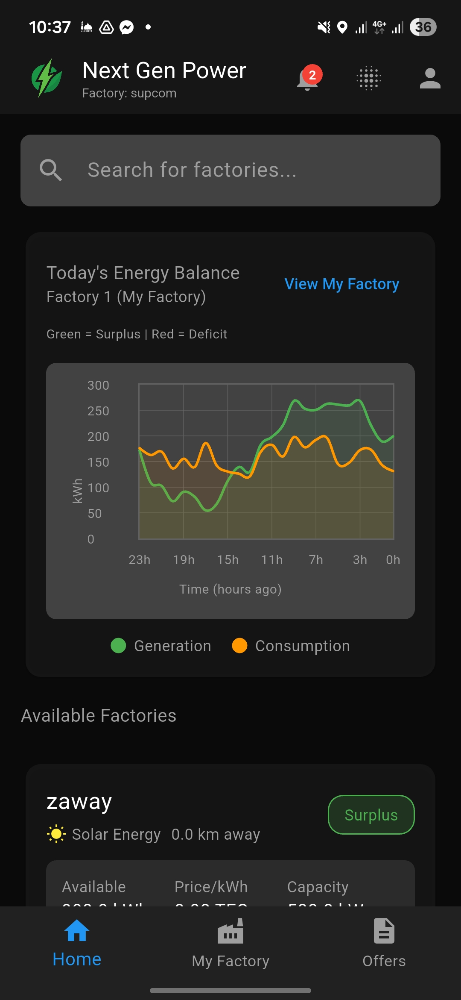

# EcoGuardians - Industrial Energy Trading & Monitoring Platform

<div align="center">


**A comprehensive Hedera Hashgraph blockchain-based energy trading system with AI-powered monitoring for industrial zones.**

[🚀 Quick Start](#-quick-start-guide) • [📸 Screenshots](#-visual-tour) • [📖 Documentation](#-documentation-hub) • [🐛 Troubleshooting](#-troubleshooting-guide)

</div>

---

## 📸 Visual Tour

### 🏗️ System Architecture


*Complete platform architecture showcasing the integration of Flutter mobile app, Hedera blockchain trading system, AI-powered energy monitoring, and IoT data collection layer.*

---

### 📱 Mobile Application Showcase

<div align="center">

| 🏭 Factory Dashboard | ⚡ Energy Trading | 🔗 Blockchain Explorer |
|:---:|:---:|:---:|
|  |  |  |
| Real-time energy monitoring & consumption analytics | P2P energy marketplace with smart offers | Live Hedera transaction tracking |

| 📊 Energy Monitoring | 🏪 Factory Profile | 🎛️ Settings & Controls |
|:---:|:---:|:---:|
|  |  |  |
| Detailed power consumption breakdowns | Factory info & token balance management | User preferences & app configuration |

</div>

---

## 🌟 Overview

**EcoGuardians** is a revolutionary platform that transforms industrial energy management through cutting-edge technology:

<table>
<tr>
<td width="33%" align="center">
<h3>⛓️ Blockchain Trading</h3>
<p>Powered by <b>Hedera Hashgraph</b> for instant, secure energy transactions using TEC tokens</p>
</td>
<td width="33%" align="center">
<h3>🤖 AI-Powered Insights</h3>
<p>Advanced ML models for energy disaggregation, predictive maintenance & demand forecasting</p>
</td>
<td width="33%" align="center">
<h3>📱 Intuitive Mobile App</h3>
<p>Beautiful Flutter-based interface for seamless factory energy management on-the-go</p>
</td>
</tr>
</table>

### 💡 Why EcoGuardians?

- ✨ **Transparent Trading**: Every energy transaction recorded on blockchain
- 🎯 **Smart Analytics**: AI-driven insights reduce energy waste by up to 30%
- 🚀 **Lightning Fast**: Hedera's consensus enables 10,000+ TPS
- 🔒 **Enterprise Security**: Bank-grade encryption and access control
- 🌍 **Sustainable Future**: Promote renewable energy adoption

---

## 📁 Project Structure

```
EcoGuardians-main/
├── flutter_application_1/         # 📱 Mobile app (next gen-power)
├── blockchain/
│   ├── hedera-energy-trading/    # ⛓️ Trading platform (Node.js + PostgreSQL)
│   └── files/                    # Energy data recording
├── AI-models/
│   ├── Desagrigation-model/      # 🤖 NILM energy disaggregation
│   └── Failure-detection/        # ⚠️ Equipment failure detection
```

---

## 🚀 Quick Start Guide

> ⏱️ **Get started in under 10 minutes!**

### 🗃️ Step 1: Setup Database

```bash
# Install PostgreSQL
sudo apt install postgresql

# Create database
sudo -u postgres psql
CREATE DATABASE ecoguardians;
\q
```

<details>
<summary>📝 <b>Click for Windows instructions</b></summary>

```powershell
# Download PostgreSQL from https://www.postgresql.org/download/windows/
# After installation, open pgAdmin or SQL Shell
CREATE DATABASE ecoguardians;
```
</details>

---

### ⚙️ Step 2: Start Backend Server

```bash
cd blockchain/hedera-energy-trading
npm install

# Configure environment
cp .env.example .env
# ✏️ Edit .env with your Hedera credentials

# Initialize & start
npm run init  # Create TEC token
npm start     # Launch server on port 3000
```

> 🔑 **Need Hedera credentials?** Visit [portal.hedera.com](https://portal.hedera.com) to create a free testnet account

---

### 📱 Step 3: Launch Mobile App

```bash
cd flutter_application_1
flutter pub get
flutter run

# Choose your target platform:
# 📱 Android: Press 'a'
# 🍎 iOS: Press 'i'
# 🌐 Web: Press 'w'
```

---

### 🎉 You're Ready!

✨ Open the app and register your first factory to start trading energy!

---

## 📱 Mobile App Features

<table>
<tr>
<td width="50%">

### 🔐 Authentication & Security
- ✅ Secure factory registration with validation
- ✅ JWT-based authentication system
- ✅ Role-based access control
- ✅ Encrypted credential storage

### ⚡ Energy Management
- ✅ Real-time consumption monitoring
- ✅ Historical data visualization
- ✅ Appliance-level disaggregation
- ✅ Cost analysis & reporting

</td>
<td width="50%">

### 🏪 Trading Marketplace
- ✅ Browse available energy offers
- ✅ Create custom trade proposals
- ✅ Instant P2P transactions
- ✅ Automated smart contract execution

### 🔗 Blockchain Integration
- ✅ Live transaction history
- ✅ TEC token balance tracking
- ✅ Hedera explorer integration
- ✅ Transaction receipt generation

</td>
</tr>
</table>

> 📚 **Detailed Documentation**: See [flutter_application_1/README.md](flutter_application_1/README.md) for complete setup guide

---

## 🔑 Technology Stack

<div align="center">

| Layer | Technology | Purpose |
|-------|------------|---------|
| ⛓️ **Blockchain** | Hedera Hashgraph | Decentralized energy trading ledger |
| 🪙 **Token** | TEC (Tunisian Energy Coin) | Native platform currency |
| 🖥️ **Backend** | Node.js + Express | RESTful API server |
| 🗄️ **Database** | PostgreSQL | Factory & transaction data |
| 📱 **Mobile** | Flutter (Dart) | Cross-platform app development |
| 🤖 **AI/ML** | Python + TensorFlow | Energy analytics & predictions |
| 🔌 **IoT** | Arduino + Sensors | Real-time energy monitoring |
| 🔐 **Security** | JWT + bcrypt | Authentication & encryption |

</div>

---

## 📚 API Reference

### 🔐 Authentication Endpoints

| Method | Endpoint | Description |
|--------|----------|-------------|
| `POST` | `/api/factory/register` | Register new factory with credentials |
| `POST` | `/api/factory/login` | Authenticate & receive JWT token |

### ⚡ Energy Trading Endpoints

| Method | Endpoint | Description |
|--------|----------|-------------|
| `POST` | `/api/energy/mint` | Convert real energy → TEC tokens |
| `POST` | `/api/trade/create` | List energy for sale |
| `POST` | `/api/trade/execute` | Purchase energy from marketplace |

### 📊 Query Endpoints

| Method | Endpoint | Description |
|--------|----------|-------------|
| `GET` | `/api/factories` | Retrieve all registered factories |
| `GET` | `/api/factory/:id/balance` | Check TEC token balance |
| `GET` | `/api/treasury/transactions` | View blockchain history |

> 📖 **Complete API Documentation**: [blockchain/hedera-energy-trading/README.md](blockchain/hedera-energy-trading/README.md)

---

## 🔧 Configuration

**Environment Variables** (`.env`):
```env
# Hedera Credentials
MY_ACCOUNT_ID=0.0.XXXXXXX
MY_PRIVATE_KEY=302e...
TEC_TOKEN_ID=0.0.XXXXXXX

# Database
DB_HOST=localhost
DB_PORT=5432
DB_NAME=ecoguardians
DB_USER=postgres
DB_PASSWORD=your_password

# Server
PORT=3000
```

---

## 🐛 Troubleshooting Guide

<table>
<tr>
<td width="40%"><b>⚠️ Issue</b></td>
<td width="60%"><b>✅ Solution</b></td>
</tr>
<tr>
<td>PostgreSQL connection failed</td>
<td>
Check service status: <code>sudo systemctl status postgresql</code><br>
Restart if needed: <code>sudo systemctl restart postgresql</code>
</td>
</tr>
<tr>
<td>TEC token not found</td>
<td>
Initialize token: <code>npm run init</code> in backend folder<br>
Update <code>TEC_TOKEN_ID</code> in <code>.env</code>
</td>
</tr>
<tr>
<td>bcrypt compilation error (Windows)</td>
<td>
Use WSL for backend or install: <code>npm install -g windows-build-tools</code>
</td>
</tr>
<tr>
<td>Flutter build fails</td>
<td>
Accept licenses: <code>flutter doctor --android-licenses</code><br>
Run: <code>flutter clean && flutter pub get</code>
</td>
</tr>
<tr>
<td>App can't connect to backend</td>
<td>
✓ Backend running on port 3000<br>
✓ Update API URL in app config<br>
✓ Check firewall settings
</td>
</tr>
<tr>
<td>Hedera transaction fails</td>
<td>
✓ Verify account has HBAR balance<br>
✓ Check network status on <a href="https://status.hedera.com">status.hedera.com</a><br>
✓ Confirm credentials in <code>.env</code>
</td>
</tr>
</table>

> 💡 **Still stuck?** Check the detailed docs in each component folder or open an issue!

---

## 📊 Blockchain Monitoring

**Track Your Transactions on Hedera Network:**

🔍 **Testnet Explorer**: `https://hashscan.io/testnet/transaction/{txId}`  
🪙 **TEC Token Info**: `https://hashscan.io/testnet/token/{TEC_TOKEN_ID}`

<div align="center">


</div>

---

## 🎯 Setup Checklist

<table>
<tr><td width="5%">⬜</td><td>Install PostgreSQL & create <code>ecoguardians</code> database</td></tr>
<tr><td>⬜</td><td>Install Node.js (v16+) & npm dependencies</td></tr>
<tr><td>⬜</td><td>Create free Hedera testnet account at <a href="https://portal.hedera.com">portal.hedera.com</a></td></tr>
<tr><td>⬜</td><td>Configure <code>.env</code> file with Hedera credentials</td></tr>
<tr><td>⬜</td><td>Initialize TEC token (<code>npm run init</code>)</td></tr>
<tr><td>⬜</td><td>Start backend server (<code>npm start</code>)</td></tr>
<tr><td>⬜</td><td>Install Flutter SDK (v3.0+)</td></tr>
<tr><td>⬜</td><td>Run mobile app (<code>flutter run</code>)</td></tr>
<tr><td>⬜</td><td>Register your first factory through the app</td></tr>
<tr><td>⬜</td><td>Execute your first energy trade! 🎉</td></tr>
</table>

---

## 📖 Documentation Hub

<table>
<tr>
<td width="33%" align="center">
<h3>📱 Mobile App</h3>
<a href="flutter_application_1/BUILD_INSTRUCTIONS.md">Build Instructions</a><br>
<a href="flutter_application_1/README.md">Feature Overview</a>
</td>
<td width="33%" align="center">
<h3>⛓️ Blockchain</h3>
<a href="blockchain/hedera-energy-trading/README.md">API Documentation</a><br>
<a href="blockchain/hedera-energy-trading/HOW_IT_WORKS.md">How It Works</a>
</td>
<td width="33%" align="center">
<h3>🏗️ Architecture</h3>
<a href="ARCHITECTURE.md">System Design</a><br>
<a href="SETUP.md">Detailed Setup</a>
</td>
</tr>
</table>

---

## 🤝 Contributing & Roadmap

### 🚀 Future Enhancements

<table>
<tr>
<td width="50%">

**Phase 1 - Q1 2026**
- 🌍 Multi-region trading zones
- 📈 Advanced analytics dashboard
- 🔔 Real-time push notifications
- 🌙 Dark mode theme

</td>
<td width="50%">

**Phase 2 - Q2 2026**
- 🌱 Carbon credit integration
- 🤖 Enhanced AI predictions
- 📡 Live IoT data streaming
- 💱 Multi-token support

</td>
</tr>
</table>

### 🎨 How to Contribute

We welcome contributions! Whether it's:
- 🐛 Bug fixes
- ✨ New features
- 📝 Documentation improvements
- 🧪 Test coverage

**Get Started:**
1. Fork the repository
2. Create your feature branch (`git checkout -b feature/AmazingFeature`)
3. Commit your changes (`git commit -m 'Add some AmazingFeature'`)
4. Push to the branch (`git push origin feature/AmazingFeature`)
5. Open a Pull Request

---

## 📝 License

This project is licensed under the Apache License 2.0 - see the [LICENSE](LICENSE) file for details.

---

<div align="center">

### ⚡ Built with Hedera Hashgraph for Sustainable Energy Trading 🌱

**Making industrial energy management transparent, efficient, and eco-friendly**

<br>


*© 2026 EcoGuardians - Empowering Industries for a Greener Tomorrow*

</div>
